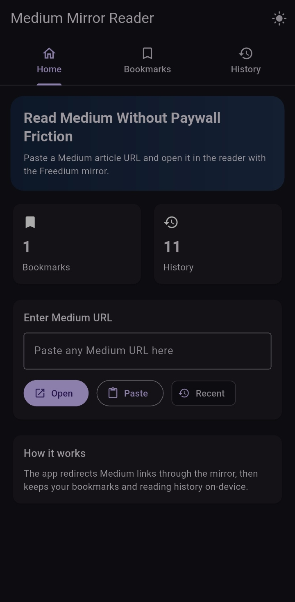
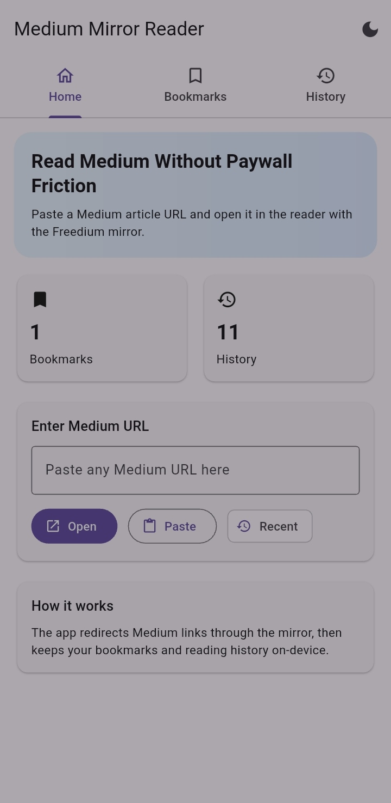

# Medium Mirror Reader

Medium Mirror Reader is a Flutter app that opens Medium links through the Freedium mirror for a cleaner reading flow.

The app supports direct paste, deep links, bookmarks, and reading history, while keeping data on-device.

## Features

- Accepts Medium links from paste input and deep links.
- Normalizes and transforms Medium URLs into Freedium mirror URLs.
- In-app article reader powered by WebView.
- Bookmarks and reading history stored locally with SharedPreferences.
- Light and dark theme toggle.
- Share mirror links directly from the reader.

## Screenshots

<p align="center">
	
	
</p>

## Tech Stack

- Flutter
- Provider (state management)
- webview_flutter
- app_links
- shared_preferences
- share_plus
- url_launcher

## Project Structure

```text
lib/
	main.dart              # app entry + home/deeplink routing
	ArticleView.dart       # reader screen + webview handling
	UrlTransformer.dart    # Medium/Freedium URL parsing and transformation
	StorageService.dart    # bookmarks/history persistence
	ThemeProvider.dart     # app theme mode state
```

## Getting Started

### Prerequisites

- Flutter SDK installed and available on PATH.
- Android Studio or Xcode (depending on target platform).
- A connected emulator/device.

Check your setup:

```bash
flutter doctor
```

### Install and Run

```bash
flutter pub get
flutter run
```

## Usage

1. Launch the app.
2. Paste a Medium URL (or open a supported deep link).
3. Open the article in the reader.
4. Bookmark or share from the article screen.

## Deep Link Notes

The app listens for incoming links and routes supported Medium URLs directly to the reader screen.

If you want to test deep links locally:

```bash
# Android example
adb shell am start -a android.intent.action.VIEW -d "https://medium.com/some-article"
```

## Build

```bash
# Android APK
flutter build apk --release

# Android App Bundle
flutter build appbundle --release

# iOS (macOS only)
flutter build ios --release
```

## Security and Privacy

- Bookmarks and history are saved only on the local device.
- Do not commit signing keys or credentials.
- Keep platform signing files private (see .gitignore).
